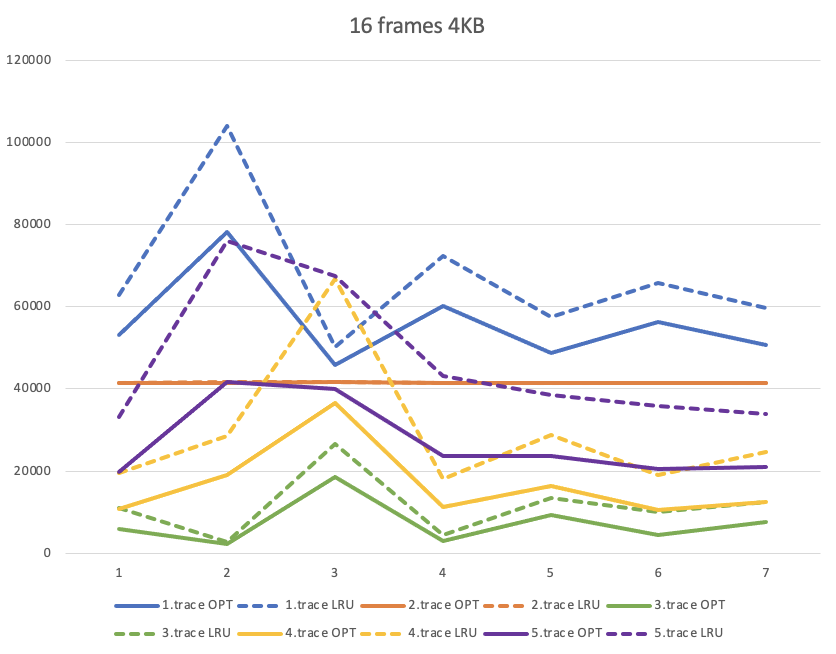
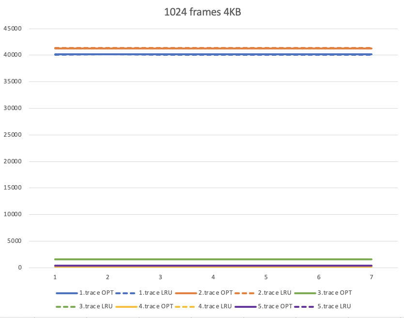
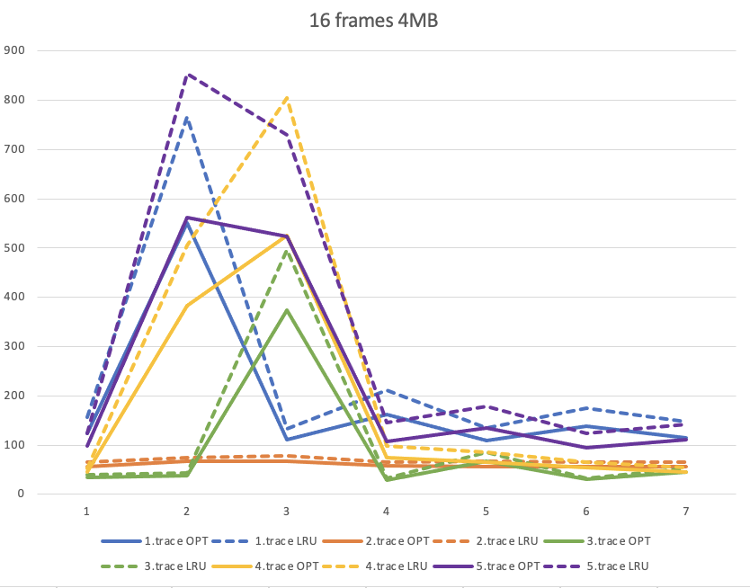
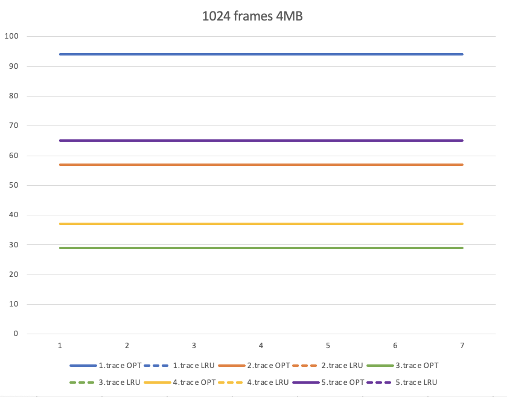

Dominique Mittermeier
project 3 write up 

These four graphs were created using the output from vmsim.java. Each graph represents a different memory configuration. Within the graph we have ten lines. Each memory split is its own line. Two lines per memory split, one for each process (LRU vs OPT). (LRU are dotted lines.) After analyzing the graphs it is concluded that OPT is the optimial algorithm when handling a low frame count. There is a signifigant difference between the number of page faults when handling 16 frames. 1.trace had the highest page faults and 3.trace had the lowest. 3.trace also had the closest similiarity within the page faults, but OPT was never worse than LRU. Once the frames become a higher number the difference between OPT page fault performance and LRU page fault performance becomes less critical. The page size did not make much of a difference on this. For 4 KB and 4 MB, when handling 1024 frames, both algorithms were aligned with page faults. Therefore there was no clearly more efficient program. 

Comparing frames to frames, when you increase them despite the algorithm, page fault occurances decrease signifigantly. 
Comparing page size to size, when you increase them, despite the algorithm, page faults occurances decreases signifigantly. 

All in all, to have minimal page faults you should have a large amount of frames and a large page size. 

